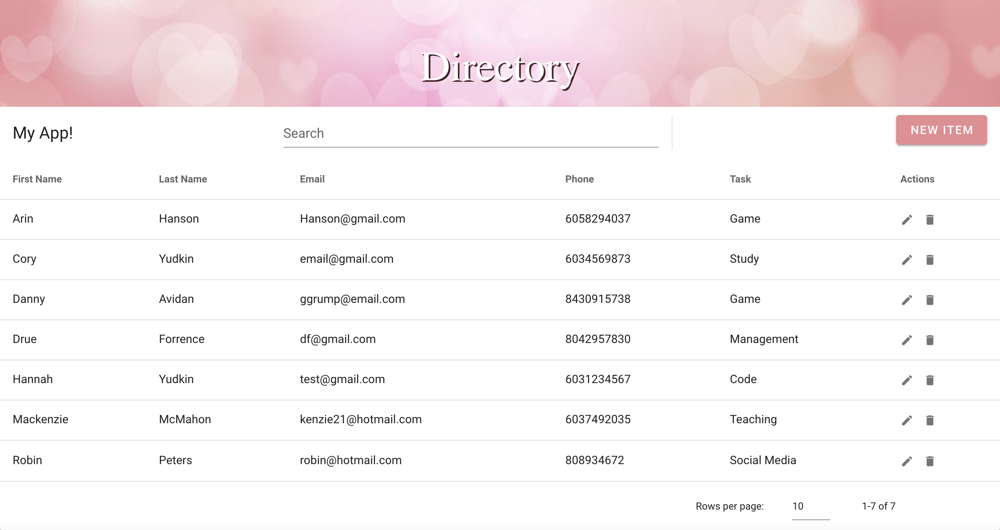

# Rails User Directory

## Project Description:

A User Directory that stores first name, last name, email, phone number, and tasks of an individual. You can sort by either category, create, read, update, and delete individuals, and view the current date.

## Preview

## Built With:

- Vue.js
- Vuetify
- Ruby
- Ruby on Rails
- PostgreSQL
- Rspec

## Contributors:

Hannah Yudkin
